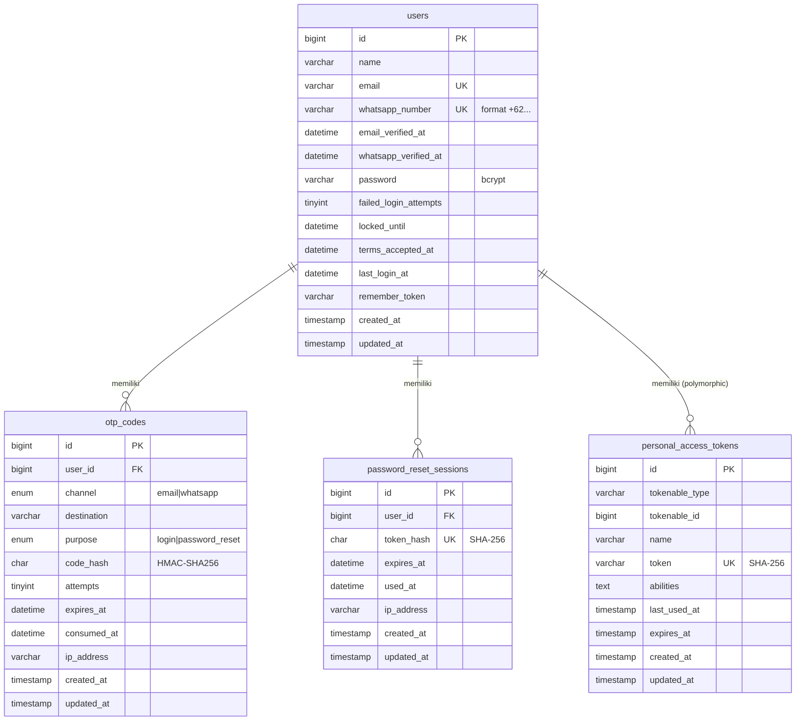

# Dokumentasi Database – Amanah Auth API

DBMS: **MySQL 8** (juga kompatibel PostgreSQL 14+; migration memakai Schema Builder Laravel). Charset `utf8mb4`.

## 1. ERD

Gambar: [`erd.svg`](erd.svg). Versi Mermaid (otomatis ter-render di GitHub):



## 2. Struktur Tabel

### `users`
| Kolom | Tipe | Null | Keterangan |
|---|---|---|---|
| id | BIGINT UNSIGNED | NO | PK, auto increment |
| name | VARCHAR(255) | NO | Nama lengkap (sesuai KTP) |
| email | VARCHAR(255) | NO | **UNIQUE**, disimpan lowercase |
| whatsapp_number | VARCHAR(20) | YES | **UNIQUE**, format E.164 `+62...` |
| email_verified_at | DATETIME | YES | Terisi saat email terverifikasi via OTP lupa password |
| whatsapp_verified_at | DATETIME | YES | Terisi saat OTP WhatsApp berhasil |
| password | VARCHAR(255) | NO | Hash bcrypt (cast `hashed`) |
| failed_login_attempts | TINYINT UNSIGNED | NO | Default 0, hitungan gagal login ("Sisa Nx") |
| locked_until | DATETIME | YES | Akun terkunci sampai waktu ini |
| terms_accepted_at | DATETIME | YES | Waktu persetujuan Syarat & Kebijakan Privasi |
| last_login_at | DATETIME | YES | Login terakhir |
| remember_token | VARCHAR(100) | YES | Bawaan Laravel |
| created_at, updated_at | TIMESTAMP | YES | |

### `otp_codes`
| Kolom | Tipe | Null | Keterangan |
|---|---|---|---|
| id | BIGINT UNSIGNED | NO | PK |
| user_id | BIGINT UNSIGNED | YES | FK → users.id (ON DELETE CASCADE) |
| channel | ENUM('email','whatsapp') | NO | Kanal pengiriman |
| destination | VARCHAR(191) | NO | Email / nomor WA tujuan |
| purpose | ENUM('login','password_reset') | NO | Tujuan OTP |
| code_hash | CHAR(64) | NO | HMAC-SHA256 (OTP **tidak** disimpan plaintext) |
| attempts | TINYINT UNSIGNED | NO | Percobaan salah, default 0 (maks 5) |
| expires_at | DATETIME | NO | Kedaluwarsa (default +5 menit) |
| consumed_at | DATETIME | YES | Terisi saat dipakai / di-invalidate (sekali pakai) |
| ip_address | VARCHAR(45) | YES | IPv4/IPv6 peminta |
| created_at, updated_at | TIMESTAMP | YES | Dipakai juga untuk cooldown kirim ulang (60 detik) |

### `password_reset_sessions`
| Kolom | Tipe | Null | Keterangan |
|---|---|---|---|
| id | BIGINT UNSIGNED | NO | PK |
| user_id | BIGINT UNSIGNED | NO | FK → users.id (ON DELETE CASCADE) |
| token_hash | CHAR(64) | NO | **UNIQUE**, SHA-256 dari reset token |
| expires_at | DATETIME | NO | Default +10 menit |
| used_at | DATETIME | YES | Sekali pakai |
| ip_address | VARCHAR(45) | YES | |
| created_at, updated_at | TIMESTAMP | YES | |

### `personal_access_tokens` (Laravel Sanctum)
`id`, `tokenable_type`, `tokenable_id` (→ users.id), `name`, `token` (UNIQUE, SHA-256), `abilities`, `last_used_at`, `expires_at`, timestamps. Dibuat dari migration bawaan Sanctum.

## 3. Relasi
| Relasi | Kardinalitas | Aksi |
|---|---|---|
| users → otp_codes | 1 : N | `otp_codes.user_id` CASCADE |
| users → password_reset_sessions | 1 : N | `user_id` CASCADE |
| users → personal_access_tokens | 1 : N (polymorphic `tokenable`) | dihapus manual saat reset password / logout |

## 4. Constraint & Index
| Tabel | Constraint / Index | Tujuan |
|---|---|---|
| users | `PRIMARY KEY (id)` | |
| users | `UNIQUE (email)` | Cegah email ganda ("Sudah Terdaftar") |
| users | `UNIQUE (whatsapp_number)` | Cegah nomor WA ganda; lookup login WA |
| otp_codes | `PRIMARY KEY (id)` | |
| otp_codes | `FOREIGN KEY (user_id) → users(id) ON DELETE CASCADE` (+ index otomatis) | Integritas data |
| otp_codes | `INDEX otp_lookup_idx (destination, purpose, consumed_at)` | Query verifikasi OTP aktif |
| otp_codes | `INDEX (expires_at)` | Pembersihan OTP kedaluwarsa |
| otp_codes | `ENUM channel, purpose` | Batasi nilai valid |
| password_reset_sessions | `UNIQUE (token_hash)` | Lookup token O(1) + anti duplikat |
| password_reset_sessions | `FOREIGN KEY (user_id) → users(id) ON DELETE CASCADE` | |
| personal_access_tokens | `UNIQUE (token)`, `INDEX (tokenable_type, tokenable_id)`, `INDEX (expires_at)` | Autentikasi cepat |

## 5. Keputusan Desain Keamanan
- Password: bcrypt (`hashed` cast). Tidak pernah dikembalikan di respons (`$hidden`).
- OTP: dihash HMAC-SHA256 dengan `APP_KEY`, kedaluwarsa 5 menit, sekali pakai, maks 5 percobaan salah, cooldown kirim ulang 60 detik, OTP lama otomatis di-invalidate saat OTP baru dibuat.
- Reset token: random 64 karakter, hanya hash-nya yang disimpan, sekali pakai, kedaluwarsa 10 menit.
- Access token: Sanctum (hash SHA-256 di DB), ada `expires_at` (24 jam, atau 30 hari jika `remember=true`).
- Lupa password: respons tidak membedakan akun ada/tidak (anti user-enumeration).
- Brute force login: 5 gagal → akun terkunci 15 menit (HTTP 423) + rate limit per IP (`throttle`).

## 6. Pembersihan Data (opsional)
```sql
DELETE FROM otp_codes WHERE expires_at < NOW() - INTERVAL 1 DAY;
DELETE FROM password_reset_sessions WHERE expires_at < NOW() - INTERVAL 1 DAY;
```
